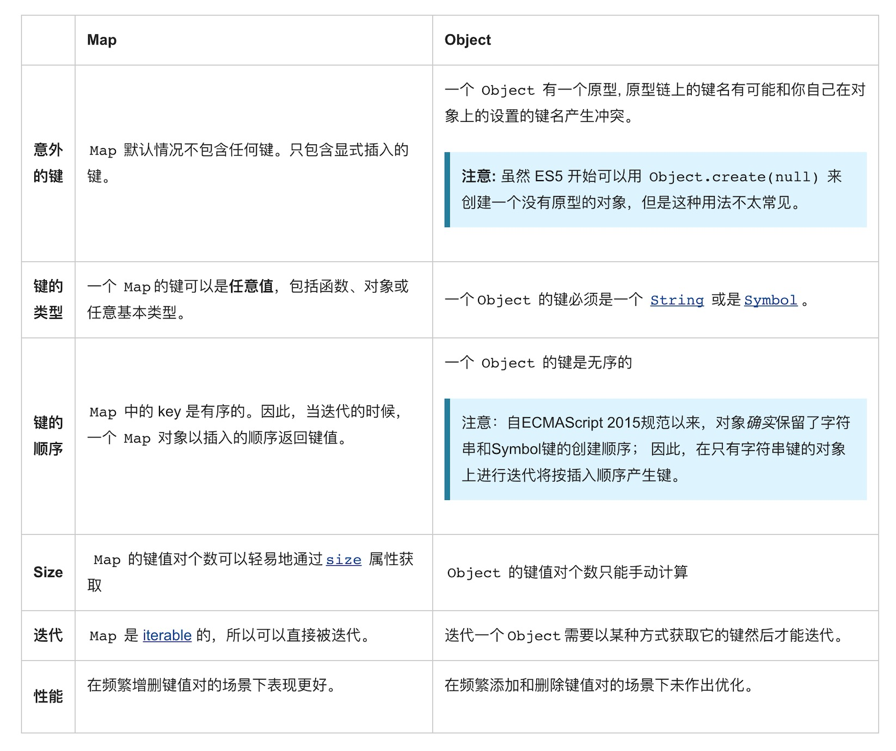

## 语法和使用

``` javascript
let myMap = new Map();

let keyObj = {};
let keyFunc = function() {};
let keyString = 'a string';

// 添加键
myMap.set(keyString, "和键'a string'关联的值");
myMap.set(keyObj, "和键keyObj关联的值");
myMap.set(keyFunc, "和键keyFunc关联的值");

myMap.size; // 3

// 读取值
myMap.get(keyString);    // "和键'a string'关联的值"
myMap.get(keyObj);       // "和键keyObj关联的值"
myMap.get(keyFunc);      // "和键keyFunc关联的值"

myMap.get('a string');   // "和键'a string'关联的值"
                         // 因为keyString === 'a string'
myMap.get({});           // undefined, 因为keyObj !== {}
myMap.get(function() {}); // undefined, 因为keyFunc !== function () {}
```
NaN 也可以作为Map对象的键。虽然 NaN 和任何值甚至和自己都不相等(NaN !== NaN 返回true)，但下面的例子表明，NaN作为Map的键来说是没有区别的:

``` javascript
let myMap = new Map();
myMap.set(NaN, "not a number");

myMap.get(NaN); // "not a number"

let otherNaN = Number("foo");
myMap.get(otherNaN); // "not a number"
```

## Objects 和 maps 的比较
Objects 和 Maps 类似的是，它们都允许你按键存取一个值、删除键、检测一个键是否绑定了值。因此（并且也没有其他内建的替代方式了）过去我们一直都把对象当成 Maps 使用。不过 Maps 和 Objects 有一些重要的区别，在下列情况里使用 Map 会是更好的选择：


## 方法

``` javascript
clear
    从映射中移除所有元素。
delete
    从映射中移除指定的元素。
forEach
    对映射中的每个元素执行指定操作。
get
    返回映射中的指定元素。
has
    如果映射包含指定元素，则返回 true。
set
    添加一个新建元素到映射。
toString
    返回映射的字符串表示形式。
valueOf
    返回指定对象的原始值。

```
## Map的迭代

 - 使用 for..of 方法迭代 Map
   

``` javascript
let myMap = new Map();
myMap.set(0, "zero");
myMap.set(1, "one");
for (let [key, value] of myMap) {
  console.log(key + " = " + value);
}
// 将会显示两个log。一个是"0 = zero"另一个是"1 = one"

for (let key of myMap.keys()) {
  console.log(key);
}
// 将会显示两个log。 一个是 "0" 另一个是 "1"

for (let value of myMap.values()) {
  console.log(value);
}
// 将会显示两个log。 一个是 "zero" 另一个是 "one"

for (let [key, value] of myMap.entries()) {
  console.log(key + " = " + value);
}
// 将会显示两个log。 一个是 "0 = zero" 另一个是 "1 = one"
```

 - 使用 forEach() 方法迭代 Map
   
``` javascript
myMap.forEach(function(value, key) {
  console.log(key + " = " + value);
})
// 将会显示两个logs。 一个是 "0 = zero" 另一个是 "1 = one"
```

## 参考

> [MDN](https://developer.mozilla.org/zh-CN/docs/Web/JavaScript/Reference/Global_Objects/Map)


